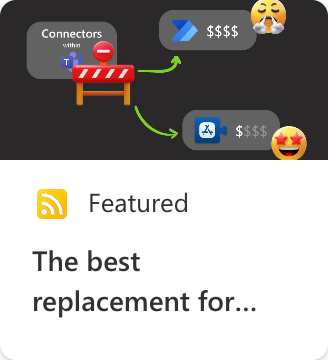
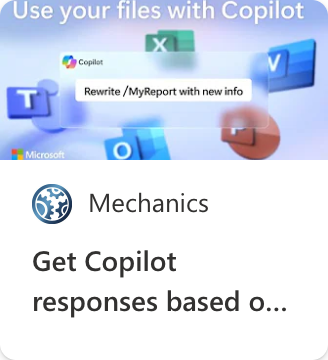
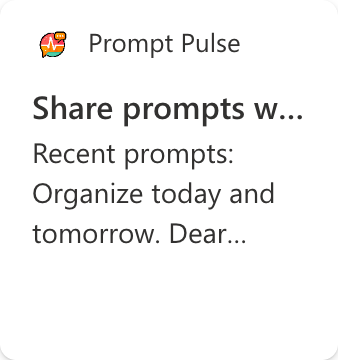
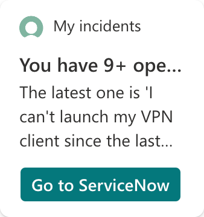
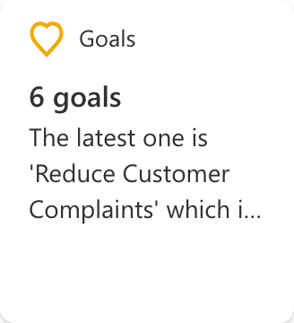

# Copilot in M365 dashboard
### Get every resource and updates for Copilot on your Viva Connections dashboard

As Microsoft's Copilot for Microsoft 365 continues to improve and help organizations increase their producitivity, it can be hard to stay up-to-date. With this Viva Connections dashboard you have the the ultimate Copilot Center of Excallence (CoE) resource ready for your organization.

## How to install the command line tool

1. Download the [`.zip`](https://github.com/adenin-platform/copilot-in-m365-dashboard/archive/refs/heads/main.zip) archive

2. Unpack the archive and open `adenin.PnPTool.exe` as an Administrator

3. Enter your SharePoint site URL, e.g. `https://m365x59762214.sharepoint.com/`

4. The command line will open the browser so you can authenticate with SharePoint

5. Once authenticated, you can close the tab. The command line tool will now install the Cards on your Viva Connections dashboard. This shuold take 2-3 minutes.

6. Once done, the command line will close by itself. You can now navigate to your Viva Connections dashboard.

## What Cards are included

- Featured

- Copilot Adoption

- Academy

- Copilot QnA

- Learning

- Blog

- Dashboard

- M365 Roadmap

- Updates

- Copilot Community

- Prompt Buddy

- Adoption

- Prompts

- Mechanics

- Scenarios

- Prompt Pulse

- Workday

- ServiceNow

- Goals (for SuccessFactors)

- Sponsored

## Is this free?

Yes, we designed this Copilot in M365 CoE dashboard to be a free one-stop-shop for all your Copilot news and resources. Some of the Cards in this dashboard are pulling live Microsoft data, for example from their blogs; but others are meant to be installed in your organization to work. [Simply speak to our team](https://forms.microsoft.com/Pages/ResponsePage.aspx?id=YcZMzgZFSE2MZMWwkKpG-1hGoYSsiA1AuSdSFitOj-xUN0wwMDRKRTBKTjVPWkRVR0hWUEZQR0FUNy4u) who will be happy to give you a no-obligation consultation on how to properly deploy your Copilot CoE dashboard.

## Can Adenin help with configuring?

Some of the Cards in this package are updating themselves with the latest CoE resources for you. And others (e.g. Dashboard, Copilot QnA, Prompt Buddy, Workday, SuccesFactors, ServiceNow, Learning) need to be configured with your organization's SharePoint instance (for example to install the Prompt Buddy PowerApp or set up the relevant Viva Engage sites). Adenin can do this job for you, [just reach out](https://forms.microsoft.com/Pages/ResponsePage.aspx?id=YcZMzgZFSE2MZMWwkKpG-1hGoYSsiA1AuSdSFitOj-xUN0wwMDRKRTBKTjVPWkRVR0hWUEZQR0FUNy4u) for a complimentary no-obgliation consultation and one of our experts can help you get your Copilot CoE off the ground.

## Where do I find these Cards after the installation?

On your Viva Connections dashboard.

## Does this work in SharePoint or in MS Teams?

In both
